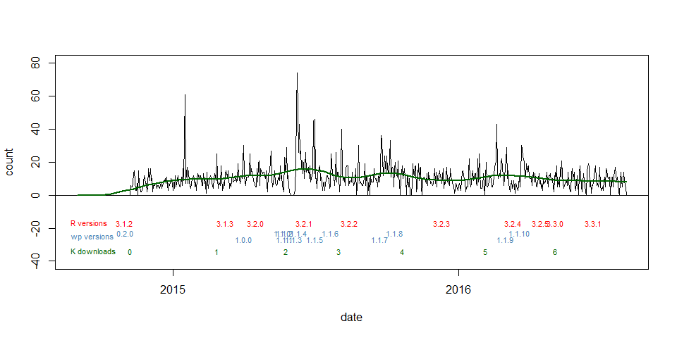
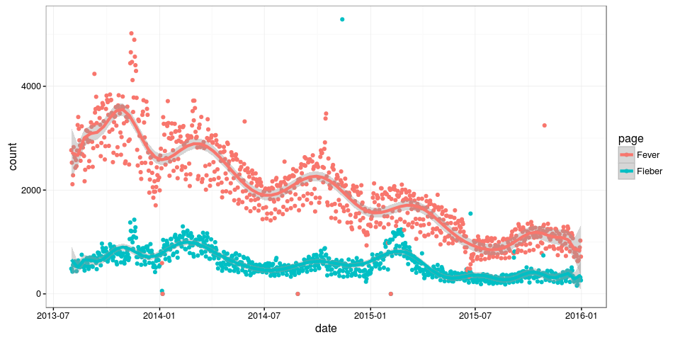

# wikipediatrend

# Author

Peter Meißner


# Last Update

2016-03-18


# Status (current version on Github)


<table>
<tr>
<td> 
Ubuntu build 
</td>
<td> 
<a href="https://travis-ci.org/petermeissner/wikipediatrend">

</a>
</td>
</tr>
<tr>
<td> 
Windows build
</td>
<td> 
<a href="https://ci.appveyor.com/project/petermeissner/wikipediatrend">

</a>
</td>
</tr>
<tr>
<td>
Version on CRAN  
</td> 
<td>
<a href="https://cran.r-project.org/package=wikipediatrend">

</a>
</td>
</tr>
<tr>
<td>
Version on Github
</td> 
<td>
<b>1.1.10</b>
</td>
</tr>
<tr>
<td>
Downloads from <a href='https://cran.rstudio.com/'>CRAN.RStudio</a>&nbsp;&nbsp;&nbsp;
</td>
<td>


</td>
</tr>

</table>


# Meta ([cranlogs](https://github.com/metacran/cranlogs)) wikipediatrend




# Purpose

The wikipediatrend package is designed to make Wikipedia page access statistics data availible in R in a most convenient way. 

*Consequently the package provides* 

- daily page views as data frames 
- page views for user set time spans
- page views for multiple articles in one function call
- page views for articles in different language domains
- a function to check article titles in other country domains
- background caching of results to minimize function execution time as well as server burdens


# Installation 

A stable version of the package can be found on CRAN and installed via ...

```r
install.packages("wikipediatrend")
```

... while the current developement version can be retrieved by using `install_github()` from the devtools package ... 


```r
devtools::install_github("petermeissner/wikipediatrend")
```

After loading the package several functions are available.


```r
library(wikipediatrend)
```


# Usage

## getting data

The workhorse of the package is the `wp_trend()` function:


```r
wp <- wp_trend(page = c("Fever","Fieber"), 
               from = "2013-08-01", 
               to   = "2015-12-31", 
               lang = c("en","de"))
```

```
## http://stats.grok.se/json/en/201308/Fever
```

```
## http://stats.grok.se/json/en/201309/Fever
```

```
## http://stats.grok.se/json/en/201310/Fever
```

```
## http://stats.grok.se/json/de/201308/Fieber
```

```
## http://stats.grok.se/json/de/201309/Fieber
```

```
## http://stats.grok.se/json/de/201310/Fieber
```

```
## http://stats.grok.se/json/de/201311/Fieber
```

```r
# (... messages shortened)
```


## glancing data

The function's return is a data frame with six variables *date*, *count*, *project*, *title*, *rank*, *month* paralleling the data provided by the stats.grok.se server:


```r
head(wp)
```

```
##   date       count lang page   rank month  title 
## 1 2013-08-01  486  de   Fieber 1391 201308 Fieber
## 2 2013-08-01 2768  en   Fever  5014 201308 Fever 
## 3 2013-08-02  476  de   Fieber 1391 201308 Fieber
## 4 2013-08-02 2529  en   Fever  5014 201308 Fever 
## 5 2013-08-03  429  de   Fieber 1391 201308 Fieber
## 6 2013-08-03 2113  en   Fever  5014 201308 Fever
```

## plotting data




## other languages

Furthermore, wikipediatrend provides a helper function `wp_linked_pages()` which allows to query wikipedia if a particualr article exists in other languages as well: 


```r
wp_linked_pages("Hitsche", lang="de")
```

```
##    page             lang   title           
## 1  Schame           bar    Schame          
## 2  Reposapeus       ca     Reposapeus      
## 3  Footstool        en     Footstool       
## 4  Reposapi%C3% ... es     Reposapiés      
## 5  %D8%B2%DB%8C ... fa     زیرپایی         
## 6  Pouf             fr     Pouf            
## 7  Skabelo          io     Skabelo         
## 8  Voetenb%C3%A ... nds-NL Voetenbänksi ...
## 9  Fotskammel       nn     Fotskammel      
## 10 Podn%C3%B3%C ... pl     Podnóżek
```


# Vignette

*For a more detailed usage have a look at the vignette accompanying the package. `vignette("using-wikipediatrend", package="wikipediatrend")`*

... or GoTo [CRAN](https://cran.r-project.org/package=wikipediatrend) or build it from scratch from [Github](https://raw.githubusercontent.com/petermeissner/wikipediatrend/master/vignettes/using-wikipediatrend.Rmd).


# Some examples for using page view statistics in general 

- politan.ch (2015-10-04): *Welche Ständeratskandidaturen interessieren?.* politan.ch. http://www.politan.ch/welche-standeratskandidaturen-interessieren/

- politan.ch (2015-05-25): *Wenn Klicks Stimmen wären.* politan.ch. http://www.politan.ch/wenn-klicks-stimmen-waren/

- Munzert, Simon (2015): *Using Wikipedia Page View Statistics to Measure Issue Salience.* WEBDATANET CONFERENCE 2015. http://conference.webdatanet.eu/uploads/submission/full_paper/35/munzert-wikipedia-webdatanet.pdf

- Wilkerson, Bill (2015): *Post-Republican debate on Wikipedia follow-up: before and after public interest in the candidates.* http://www.wrwilkerson.com/ .
http://www.wrwilkerson.com/blog/2015/8/15/post-republican-debate-on-wikipedia-follow-up-before-and-after-public-interest-in-the-candidates

- Taha Yasseri and Jonathan Bright (2015): *Predicting elections from online information flows: towards theoretically informed models*. http://arxiv.org/abs/1505.01818

- Mellon, Jonathan (2014) *Internet Search Data and Issue Salience: The Properties of Google Trends as a Measure of Issue Salience* Journal of Elections, Public Opinion and Parties 24(1):45-72.
http://www.tandfonline.com/doi/abs/10.1080/17457289.2013.846346 

- Yla Tausczik, Kate Faasse, James W. Pennebaker, Keith J. Petrie (2012): *Public Anxiety and Information Seeking Following the H1N1 Outbreak: Blogs, Newspaper Articles, and Wikipedia Visits*. Health Communication, Vol. 27, Iss. 2.
 http://www.tandfonline.com/doi/pdf/10.1080/10410236.2011.571759

- Ripberger, Joseph T. (2011): *Capturing curiosity: using Internet search trends to measure public attentiveness*. Policy Studies Journal 39(2):239-259.
http://onlinelibrary.wiley.com/doi/10.1111/j.1541-0072.2011.00406.x/full


 
*(I missed your application? Make a pull request, open an issue, drop me a line and I put it here)*


# Thanks 

Fernando Reis, Eryk Walczak, Simon Munzert, Kristin Lindemann


# Credits

- Parts of the package's code have been shamelessly copied and modified from R base package written by R core team. This concerns the `wp_date()` generic and its methods and is detailed in the help files. 


