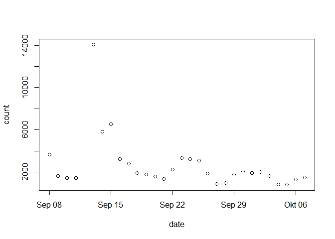
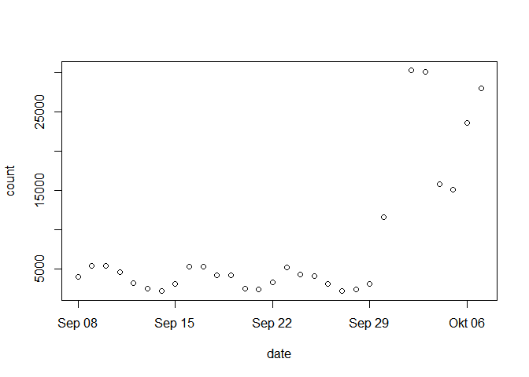
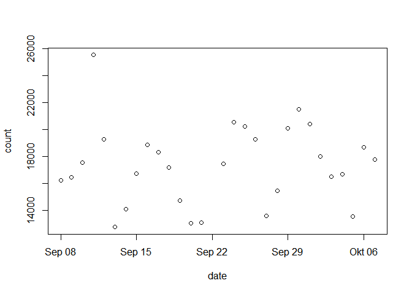

# Wikipedia Article Access Statistics
Peter Meißner  
Monday, September 29, 2014  

# Behind the scenes of Wikipedia

On Wikipedia there are a lot of information to be explored behind the scenes. One type of information are page access statistics -- e.g. http://stats.grok.se/en/201409/Peter_Principle. Another type are the info pages -- e.g. https://en.wikipedia.org/w/index.php?title=Peter_Principle&action=info.


# Access statistics

Let's have a look at how `http://stats.grok.se` works. Playing around a little with the various part of the URL reveals that we can have either a nice graphic drawn for us or we might get access counts on a dayly basis as JSON format: 

```
http://stats.grok.se/en/201409/Peter_Principle
```
versus
```
http://stats.grok.se/json/en/201409/Peter_Principle
```

The data can be returned for whole months expressed as strings with four digit years followed by two digit months. Furthermore, one can express the language for which to return the access counts and last but not least we have to specify the title of the Wikipedia article. 


```r
require(wikipediainfo)
```

```
## Loading required package: wikipediainfo
```


```r
res1 <- wp_trend("")
```

```
## http://stats.grok.se/json/en/201410/Peter_Principle
## 
## Results written to:
## D:/Peter/Dropbox/RPackages/wikipediatrend/devel/wikipediaTrend__Peter_Principle.csv
```

```r
plot(res1[res1$count < quantile(res1$count, na.rm=T, 0.99),])
```

 

```r
dim(res1)
```

```
## [1] 30  2
```

```r
res2 <- wp_trend("", pageName="Ebola")
```

```
## http://stats.grok.se/json/en/201410/Ebola
## 
## Results written to:
## D:/Peter/Dropbox/RPackages/wikipediatrend/devel/wikipediaTrend__Ebola.csv
```

```r
plot(res2[res2$count < quantile(res2$count, na.rm=T, 0.99),])
```

 

```r
dim(res2)
```

```
## [1] 30  2
```

```r
res3 <- wp_trend("", pageName="Barack_Obama")
```

```
## http://stats.grok.se/json/en/201410/Barack_Obama
## 
## Results written to:
## D:/Peter/Dropbox/RPackages/wikipediatrend/devel/wikipediaTrend__Barack_Obama.csv
```

```r
plot(res3[res3$count < quantile(res3$count, na.rm=T, 0.99),])
```

 

```r
dim(res3)
```

```
## [1] 30  2
```

```r
res4 <- wp_trend("", 
                       pageName="Angela_Merkel",
                       countryCode="de")
```

```
## http://stats.grok.se/json/de/201410/Angela_Merkel
## 
## Results written to:
## D:/Peter/Dropbox/RPackages/wikipediatrend/devel/wikipediaTrend__Angela_Merkel.csv
```

```r
dim(res4)
```

```
## [1] 30  2
```

```r
plot(res4[res4$count < quantile(res4$count, na.rm=T, 0.99),])
```

 


