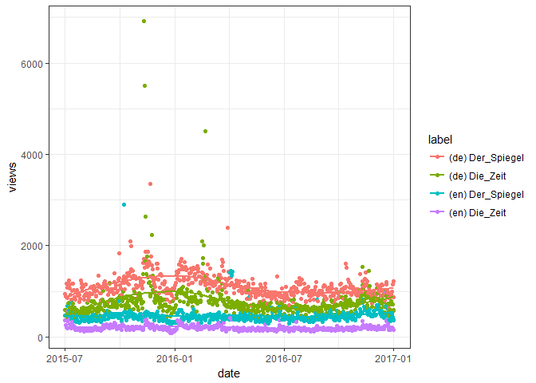

<!-- README.md is generated from README.Rmd. Please edit that file -->
Public Subject Attention via Wikipedia Page View Statistics
===========================================================

**Status**

<a href="https://travis-ci.org/petermeissner/wikipediatrend">  <a/> <a href="https://cran.r-project.org/package=wikipediatrend">  </a>  

*lines of R code:* 320, *lines of test code:* 142

**Version**

2.0.1.900000 ( 2017-09-24 20:54:36 )

**Description**

**License**

GPL (&gt;= 2) <br>Peter Meissner \[aut, cre\], \[ctb\]

**Credits**

-   Parts of the package's code have been shamelessly copied and modified from R base package written by R core team. This concerns the `wp_date()` generic and its methods and is detailed in the help files.

**Citation**

``` r
citation("wikipediatrend")
```

Meissner P (2017). *wikipediatrend: Public Subject Attention via Wikipedia Page View Statistics*. R package version 2.0.1.900000.

**BibTex for citing**

``` r
toBibtex(citation("wikipediatrend"))
```

**Installation**

Stable version from CRAN:

``` r
install.packages("wikipediatrend")
```

Latest development version from Github:

``` r
devtools::install_github("petermeissner/wikipediatrend")
```

**Usage**

*starting up ...*

``` r
library(wikipediatrend)
```

*getting some data ...*

``` r
trend_data <- 
  wp_trend(
    page = c("Der_Spiegel", "Die_Zeit"), 
    lang = c("de", "en"), 
    from = "2007-01-01",
    to   = "2017-01-01"
  )
```

*having a look ...*

``` r
trend_data
```

    ##      project   language article     access     agent      granularity date       views
    ## 1017 wikipedia de       Der_Spiegel all-access all-agents daily       2016-03-11 1051 
    ## 487  wikipedia en       Der_Spiegel all-access all-agents daily       2015-10-30  392 
    ## 255  wikipedia en       Der_Spiegel all-access all-agents daily       2015-09-02  455 
    ## 1755 wikipedia en       Der_Spiegel all-access all-agents daily       2016-09-11  467 
    ## 359  wikipedia en       Der_Spiegel all-access all-agents daily       2015-09-28  414 
    ## 1163 wikipedia en       Der_Spiegel all-access all-agents daily       2016-04-16  378 
    ## 21   wikipedia de       Der_Spiegel all-access all-agents daily       2015-07-06 1190 
    ## 1897 wikipedia de       Der_Spiegel all-access all-agents daily       2016-10-17 1259 
    ## 1337 wikipedia de       Der_Spiegel all-access all-agents daily       2016-05-30 1168 
    ## 398  wikipedia de       Die_Zeit    all-access all-agents daily       2015-10-08  869 
    ## 
    ## ... 2194 rows of data not shown

*having another look ...*

``` r
plot(trend_data)
```


