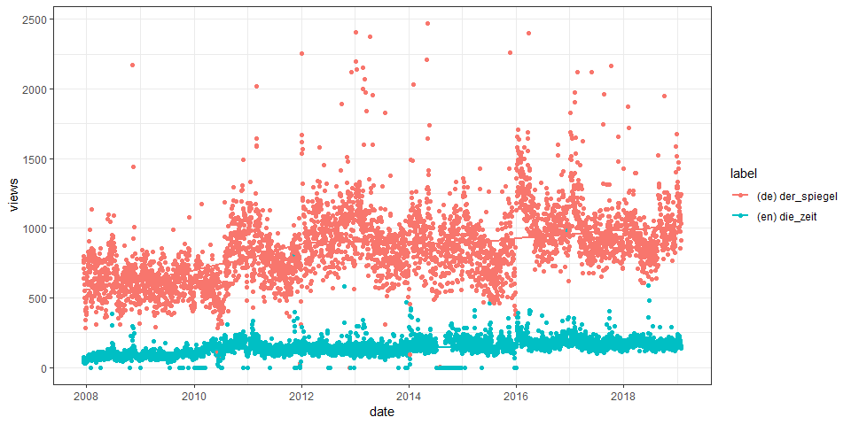

<!-- README.md is generated from README.Rmd. Please edit that file -->

# Public Subject Attention via Wikipedia Page View Statistics

**Status**

<a href="https://travis-ci.org/petermeissner/wikipediatrend">

<a/> <a href="https://codecov.io/gh/petermeissner/wikipediatrend">

</a> <a href="https://cran.r-project.org/package=wikipediatrend">
 </a>


*lines of R code:* 428, *lines of test code:* 160

**Version**

2.1.0 ( 2019-01-10 20:49:54 )

**Description**

**License**

GPL (\>= 2) <br>Peter Meissner \[aut, cre\], \[ctb\]

**Credits**

  - Parts of the package’s code have been shamelessly copied and
    modified from R base package written by R core team. This concerns
    the `wp_date()` generic and its methods and is detailed in the help
    files.

**Citation**

``` r
citation("wikipediatrend")
```

Meissner P (2018). *wikipediatrend: Public Subject Attention via
Wikipedia Page View Statistics*. R package version 2.1.0.

**BibTex for citing**

``` r
toBibtex(citation("wikipediatrend"))
```

**Installation**

Stable version from CRAN:

``` r
install.packages("wikipediatrend")
```

Latest development version from Github:

``` r
devtools::install_github("petermeissner/wikipediatrend")
```

**Usage**

*starting up …*

``` r
library(wikipediatrend)
```

    ## 
    ##   [wikipedaitrend]
    ##     
    ##   Note:
    ##     
    ##     - Data before 2016-01-01 
    ##       * is provided by petermeissner.de and
    ##       * was prepared in a project comissioned by the Hertie School of Governance (Simon Munzert)
    ##       * and supported by the Daimler and Benz Foundation.
    ##     
    ##     - Data from 2016-01-01 onwards 
    ##       * is provided by the Wikipedia Foundation
    ##       * via its pageviews package and API.
    ## 

*getting some data …*

``` r
trend_data <- 
  wp_trend(
    page = c("Der_Spiegel", "Die_Zeit"), 
    lang = c("de", "en"), 
    from = "2007-01-01",
    to   = "2017-01-01"
  )
```

*having a look …*

``` r
trend_data
```

    ##      language article     date       views
    ## 2    en       die_zeit    2007-12-10    74
    ## 1    de       der_spiegel 2007-12-10   798
    ## 4    en       die_zeit    2007-12-11    35
    ## 3    de       der_spiegel 2007-12-11   710
    ## 5    de       der_spiegel 2007-12-12   770
    ## 6618 en       die_zeit    2016-12-30   183
    ## 6620 en       die_zeit    2016-12-31   154
    ## 6619 de       der_spiegel 2016-12-31   871
    ## 6622 en       die_zeit    2017-01-01   155
    ## 6621 de       der_spiegel 2017-01-01  1215
    ## 
    ## ... 6612 rows of data not shown

*having another look …*

``` r
plot(trend_data)
```

<!-- -->
