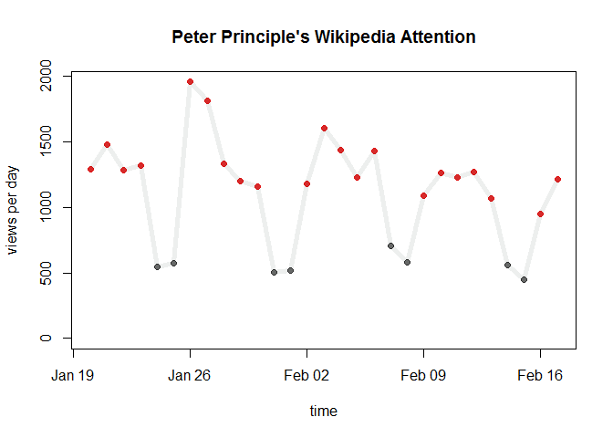
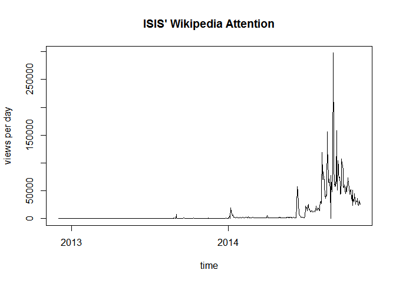
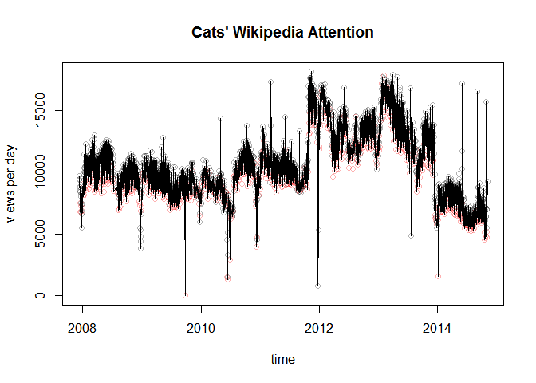
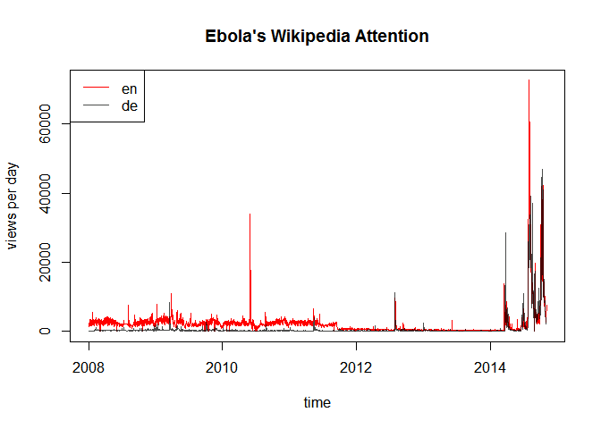

# Introducing wikipediatrend -- Easing Analyzing Puplic Attention, Anxiety and Information Seeking
Peter Meißner  
`r Sys.Date()`  

## Introduction

On Wikipedia there are a lot of information to be explored behind the scenes. One type of information are page access statistics -- e.g. http://stats.grok.se/en/201409/Peter_Principle. Another type are the info pages -- e.g. https://en.wikipedia.org/w/index.php?title=Peter_Principle&action=info. While the latter falls into the jurisdiction of the [MediaWiki](http://cran.r-project.org/web/packages/WikipediR/index.html)-package for the former no ready made package exists. 

## Stats.grok.se API and the wikipediatrend package

`http://stats.grok.se` provides an Web API to retreive Wikipedia page access statistics on a daily basis. The information is either presented in HTML or provided as JSON data. 

```
http://stats.grok.se/en/201409/Peter_Principle
```
versus
```
http://stats.grok.se/json/en/201409/Peter_Principle
```

A single request results in data for a certain page, from one of Wikipedia's different language subdomains, and for all days of a given month. The `wikipediatrend` package draws on this Web API and provides a consistent and convenient way to use those data within R. Fruthermore the package not only takes care of the communication between the Web API on `stats.grok.se` and your local R session but also allows for minimizing traffic and workload on behalf of the `stats.grok.se`-server by having a build in storage and reuse system of already used data -- data is (if user decides so) saved locally in CSV format and reused for subsequent requests. 


## A First Tutorial


```r
require(wikipediatrend)
```

```
## Loading required package: wikipediatrend
```

The workhorse of the package is the `wp_trend()` function with several arguments:

- **page**        [ `"Peter_principle"` ]: <br>
... here goes the name of the page
- **from**        [ `Sys.Date()-30` ]: <br>
... starting date of the timespan to be considered
- **to**          [ `Sys.Date()` ]: <br>
... end date of the timespan to be considered
- **lang**        [ `"en"` ]: <br>
... language of the page
- **friendly**    [ `F` ]: <br>
... should `wp_trend()` try minimize workload on behalf of `stats.grok.se`
- **requestFrom** [ `"anonymous"` ]: <br>
... do you care to identify yourself towards `stats.grok.se`


Let's have a first run using the defaults:

```r
peter_principle <- wp_trend()
```

```
## 
##     With option 'friendly' set to FALSE subsequent requests 
##     of the same wikipedia-page cause the server -- which is kindly 
##     providing information for you -- to work hard to get the same 
##     stuff over and over and over and over again. Do not bore 
##     the server - be friendly. 
##     
##     More information is found via '?wp_trend'.
##     
## http://stats.grok.se/json/en/201410/Peter_principle
```

The function informs us that using the friendly option might be a good idea and shows us which URLs it used to retreive the inforamtion we were asking for. 

The function's return is a data frame with two variables *date* and *count*:


```r
dim(peter_principle)
```

```
## [1] 30  2
```

```r
class(peter_principle)
```

```
## [1] "data.frame"
```

```r
head(peter_principle)
```

```
##                  date count
## 2014-10-01 2014-10-01  1892
## 2014-10-02 2014-10-02  1974
## 2014-10-03 2014-10-03  1638
## 2014-10-04 2014-10-04   800
## 2014-10-05 2014-10-05   826
## 2014-10-06 2014-10-06  1272
```

... that e.g. can be used directly for visualization. Using `wp_wday()` we can furthermore descriminate weekdays <span style="color:black">(black)</span> from weekends <span style="color:red">(red)</span>. 


```r
plot( peter_principle, 
      col=ifelse( wp_wday(peter_principle$date) > 5 , "red", "black") ,
      ylim=c(0, max(peter_principle$count)),
      main="Peter Principle's Wikipedia Attention",
      ylab="views per day", xlab="time")
lines(peter_principle)
```

 

Looking at the graph we can conclude that the *Peter Principle* as a work related phenomenon obviously is something that is most pressing on workdays.


## Being friendly

One of the most important features of the package is its `friendly` option. On the one hand, it saves us time when making subsequent requests of the same page because less pages have to be loaded. On the other hand, it serves to minimize workload on behalf of the `stats.grok.se`-server that kindly provides the information we are using. 

The option can be set to different values: 

- **FALSE**, the default, deactivates `wp_trend()`'s friendly behaviour alltogether
- **TRUE**, activates `wp_trend()`'s friendly behaviour and retreieved access statistics are stored on disk in CSV format via `write.csv()`
- **1** is the same as **TRUE**
- **2**, is the same as **TRUE** but storage takes place via `write.csv2()`

Let's try it out by making two subsequent requests to get access statistics for for information on ISIS. 


```r
file.remove("wp__Islamic_State_of_Iraq_and_the_Levant__en.csv")
```

```
## Warning in
## file.remove("wp__Islamic_State_of_Iraq_and_the_Levant__en.csv"): cannot
## remove file 'wp__Islamic_State_of_Iraq_and_the_Levant__en.csv', reason 'No
## such file or directory'
```

While for the first request the server has to provide information many times, the second request only asks for those months for which we do not have complete data already. Furthermore, `wp_trend()` informs us that the data has been stored in a CSV-file.


```r
isis <- wp_trend("Islamic_State_of_Iraq_and_the_Levant", from="2013-01-01", friendly=T)
```

```
## http://stats.grok.se/json/en/201301/Islamic_State_of_Iraq_and_the_Levant
## http://stats.grok.se/json/en/201302/Islamic_State_of_Iraq_and_the_Levant
## http://stats.grok.se/json/en/201303/Islamic_State_of_Iraq_and_the_Levant
## http://stats.grok.se/json/en/201304/Islamic_State_of_Iraq_and_the_Levant
## http://stats.grok.se/json/en/201305/Islamic_State_of_Iraq_and_the_Levant
## http://stats.grok.se/json/en/201306/Islamic_State_of_Iraq_and_the_Levant
## http://stats.grok.se/json/en/201307/Islamic_State_of_Iraq_and_the_Levant
## http://stats.grok.se/json/en/201308/Islamic_State_of_Iraq_and_the_Levant
## http://stats.grok.se/json/en/201309/Islamic_State_of_Iraq_and_the_Levant
## http://stats.grok.se/json/en/201310/Islamic_State_of_Iraq_and_the_Levant
## http://stats.grok.se/json/en/201311/Islamic_State_of_Iraq_and_the_Levant
## http://stats.grok.se/json/en/201312/Islamic_State_of_Iraq_and_the_Levant
## http://stats.grok.se/json/en/201401/Islamic_State_of_Iraq_and_the_Levant
## http://stats.grok.se/json/en/201402/Islamic_State_of_Iraq_and_the_Levant
## http://stats.grok.se/json/en/201403/Islamic_State_of_Iraq_and_the_Levant
## http://stats.grok.se/json/en/201404/Islamic_State_of_Iraq_and_the_Levant
## http://stats.grok.se/json/en/201405/Islamic_State_of_Iraq_and_the_Levant
## http://stats.grok.se/json/en/201406/Islamic_State_of_Iraq_and_the_Levant
## http://stats.grok.se/json/en/201407/Islamic_State_of_Iraq_and_the_Levant
## http://stats.grok.se/json/en/201408/Islamic_State_of_Iraq_and_the_Levant
## http://stats.grok.se/json/en/201409/Islamic_State_of_Iraq_and_the_Levant
## http://stats.grok.se/json/en/201410/Islamic_State_of_Iraq_and_the_Levant
## http://stats.grok.se/json/en/201411/Islamic_State_of_Iraq_and_the_Levant
## 
## Results written to:
## D:/Peter/Dropbox/RPackages/wikipediatrend/wp__Islamic_State_of_Iraq_and_the_Levant__en.csv
```

The second request uses these previous saved information to minimize traffic and function execution time. If it downloads new data, it updates the data already stored on disk.


```r
isis <- wp_trend("Islamic_State_of_Iraq_and_the_Levant", from="2012-12-01", friendly=T)
```

```
## http://stats.grok.se/json/en/201212/Islamic_State_of_Iraq_and_the_Levant
## http://stats.grok.se/json/en/201411/Islamic_State_of_Iraq_and_the_Levant
## 
## Results written to:
## D:/Peter/Dropbox/RPackages/wikipediatrend/wp__Islamic_State_of_Iraq_and_the_Levant__en.csv
```

Last but not least, let's have a look at the data ... 


```r
plot( isis, 
      ylim=c(0, max(isis$count)),
      main="ISIS' Wikipedia Attention",
      ylab="views per day", xlab="time",
      type="l")
```

 

... revealing what most might have already suspected: ISIS is a quite new penomenon. 


## So what? 

### Cats

First of all we are now able to study cats:


```r
cats <- wp_trend("Cat", from="2007-01-01", friendly=T)
```

```
## http://stats.grok.se/json/en/200712/Cat
## http://stats.grok.se/json/en/200801/Cat
## http://stats.grok.se/json/en/200802/Cat
## http://stats.grok.se/json/en/200803/Cat
## http://stats.grok.se/json/en/200804/Cat
## http://stats.grok.se/json/en/200805/Cat
## http://stats.grok.se/json/en/200806/Cat
## http://stats.grok.se/json/en/200807/Cat
## http://stats.grok.se/json/en/200808/Cat
## http://stats.grok.se/json/en/200809/Cat
## http://stats.grok.se/json/en/200810/Cat
## http://stats.grok.se/json/en/200811/Cat
## http://stats.grok.se/json/en/200812/Cat
## http://stats.grok.se/json/en/200901/Cat
## http://stats.grok.se/json/en/200902/Cat
## http://stats.grok.se/json/en/200903/Cat
## http://stats.grok.se/json/en/200904/Cat
## http://stats.grok.se/json/en/200905/Cat
## http://stats.grok.se/json/en/200906/Cat
## http://stats.grok.se/json/en/200907/Cat
## http://stats.grok.se/json/en/200908/Cat
## http://stats.grok.se/json/en/200909/Cat
## http://stats.grok.se/json/en/200910/Cat
## http://stats.grok.se/json/en/200911/Cat
## http://stats.grok.se/json/en/200912/Cat
## http://stats.grok.se/json/en/201001/Cat
## http://stats.grok.se/json/en/201002/Cat
## http://stats.grok.se/json/en/201003/Cat
## http://stats.grok.se/json/en/201004/Cat
## http://stats.grok.se/json/en/201005/Cat
## http://stats.grok.se/json/en/201006/Cat
## http://stats.grok.se/json/en/201007/Cat
## http://stats.grok.se/json/en/201008/Cat
## http://stats.grok.se/json/en/201009/Cat
## http://stats.grok.se/json/en/201010/Cat
## http://stats.grok.se/json/en/201011/Cat
## http://stats.grok.se/json/en/201012/Cat
## http://stats.grok.se/json/en/201101/Cat
## http://stats.grok.se/json/en/201102/Cat
## http://stats.grok.se/json/en/201103/Cat
## http://stats.grok.se/json/en/201104/Cat
## http://stats.grok.se/json/en/201105/Cat
## http://stats.grok.se/json/en/201106/Cat
## http://stats.grok.se/json/en/201107/Cat
## http://stats.grok.se/json/en/201108/Cat
## http://stats.grok.se/json/en/201109/Cat
## http://stats.grok.se/json/en/201110/Cat
## http://stats.grok.se/json/en/201111/Cat
## http://stats.grok.se/json/en/201112/Cat
## http://stats.grok.se/json/en/201201/Cat
## http://stats.grok.se/json/en/201202/Cat
## http://stats.grok.se/json/en/201203/Cat
## http://stats.grok.se/json/en/201204/Cat
## http://stats.grok.se/json/en/201205/Cat
## http://stats.grok.se/json/en/201206/Cat
## http://stats.grok.se/json/en/201207/Cat
## http://stats.grok.se/json/en/201208/Cat
## http://stats.grok.se/json/en/201209/Cat
## http://stats.grok.se/json/en/201210/Cat
## http://stats.grok.se/json/en/201211/Cat
## http://stats.grok.se/json/en/201212/Cat
## http://stats.grok.se/json/en/201301/Cat
## http://stats.grok.se/json/en/201302/Cat
## http://stats.grok.se/json/en/201303/Cat
## http://stats.grok.se/json/en/201304/Cat
## http://stats.grok.se/json/en/201305/Cat
## http://stats.grok.se/json/en/201306/Cat
## http://stats.grok.se/json/en/201307/Cat
## http://stats.grok.se/json/en/201308/Cat
## http://stats.grok.se/json/en/201309/Cat
## http://stats.grok.se/json/en/201310/Cat
## http://stats.grok.se/json/en/201311/Cat
## http://stats.grok.se/json/en/201312/Cat
## http://stats.grok.se/json/en/201401/Cat
## http://stats.grok.se/json/en/201402/Cat
## http://stats.grok.se/json/en/201403/Cat
## http://stats.grok.se/json/en/201404/Cat
## http://stats.grok.se/json/en/201405/Cat
## http://stats.grok.se/json/en/201406/Cat
## http://stats.grok.se/json/en/201407/Cat
## http://stats.grok.se/json/en/201408/Cat
## http://stats.grok.se/json/en/201409/Cat
## http://stats.grok.se/json/en/201410/Cat
## http://stats.grok.se/json/en/201411/Cat
## 
## Results written to:
## D:/Peter/Dropbox/RPackages/wikipediatrend/wp__Cat__en.csv
```

```r
  # throw out extreme values
  no_outlier <- 
  cats$count < 
    quantile(cats$count, na.rm=T, 0.99) & 
  cats$count > 
    quantile(cats$count, na.rm=T, 0.01)  
cats <- cats[no_outlier,]
plot( cats, 
      col=ifelse( wp_wday(cats$date) > 5 , rgb(1,0,0,0.3), rgb(0,0,0,0.3)) ,
      ylim=c(0, max(cats$count)),
      main="Cats' Wikipedia Attention",
      ylab="views per day", xlab="time")
lines(cats)
```

 

... and triumphantly can conclude: 

**Cats are sooooo 2012 and 2013.**.

### Ebola

Or we can study how the desire to inform oneself about Ebola varies over time:


```r
ebola_en <- wp_trend("Ebola", from="2008-01-01", friendly=T)
```

```
## http://stats.grok.se/json/en/200801/Ebola
## http://stats.grok.se/json/en/200802/Ebola
## http://stats.grok.se/json/en/200803/Ebola
## http://stats.grok.se/json/en/200804/Ebola
## http://stats.grok.se/json/en/200805/Ebola
## http://stats.grok.se/json/en/200806/Ebola
## http://stats.grok.se/json/en/200807/Ebola
## http://stats.grok.se/json/en/200808/Ebola
## http://stats.grok.se/json/en/200809/Ebola
## http://stats.grok.se/json/en/200810/Ebola
## http://stats.grok.se/json/en/200811/Ebola
## http://stats.grok.se/json/en/200812/Ebola
## http://stats.grok.se/json/en/200901/Ebola
## http://stats.grok.se/json/en/200902/Ebola
## http://stats.grok.se/json/en/200903/Ebola
## http://stats.grok.se/json/en/200904/Ebola
## http://stats.grok.se/json/en/200905/Ebola
## http://stats.grok.se/json/en/200906/Ebola
## http://stats.grok.se/json/en/200907/Ebola
## http://stats.grok.se/json/en/200908/Ebola
## http://stats.grok.se/json/en/200909/Ebola
## http://stats.grok.se/json/en/200910/Ebola
## http://stats.grok.se/json/en/200911/Ebola
## http://stats.grok.se/json/en/200912/Ebola
## http://stats.grok.se/json/en/201001/Ebola
## http://stats.grok.se/json/en/201002/Ebola
## http://stats.grok.se/json/en/201003/Ebola
## http://stats.grok.se/json/en/201004/Ebola
## http://stats.grok.se/json/en/201005/Ebola
## http://stats.grok.se/json/en/201006/Ebola
## http://stats.grok.se/json/en/201007/Ebola
## http://stats.grok.se/json/en/201008/Ebola
## http://stats.grok.se/json/en/201009/Ebola
## http://stats.grok.se/json/en/201010/Ebola
## http://stats.grok.se/json/en/201011/Ebola
## http://stats.grok.se/json/en/201012/Ebola
## http://stats.grok.se/json/en/201101/Ebola
## http://stats.grok.se/json/en/201102/Ebola
## http://stats.grok.se/json/en/201103/Ebola
## http://stats.grok.se/json/en/201104/Ebola
## http://stats.grok.se/json/en/201105/Ebola
## http://stats.grok.se/json/en/201106/Ebola
## http://stats.grok.se/json/en/201107/Ebola
## http://stats.grok.se/json/en/201108/Ebola
## http://stats.grok.se/json/en/201109/Ebola
## http://stats.grok.se/json/en/201110/Ebola
## http://stats.grok.se/json/en/201111/Ebola
## http://stats.grok.se/json/en/201112/Ebola
## http://stats.grok.se/json/en/201201/Ebola
## http://stats.grok.se/json/en/201202/Ebola
## http://stats.grok.se/json/en/201203/Ebola
## http://stats.grok.se/json/en/201204/Ebola
## http://stats.grok.se/json/en/201205/Ebola
## http://stats.grok.se/json/en/201206/Ebola
## http://stats.grok.se/json/en/201207/Ebola
## http://stats.grok.se/json/en/201208/Ebola
## http://stats.grok.se/json/en/201209/Ebola
## http://stats.grok.se/json/en/201210/Ebola
## http://stats.grok.se/json/en/201211/Ebola
## http://stats.grok.se/json/en/201212/Ebola
## http://stats.grok.se/json/en/201301/Ebola
## http://stats.grok.se/json/en/201302/Ebola
## http://stats.grok.se/json/en/201303/Ebola
## http://stats.grok.se/json/en/201304/Ebola
## http://stats.grok.se/json/en/201305/Ebola
## http://stats.grok.se/json/en/201306/Ebola
## http://stats.grok.se/json/en/201307/Ebola
## http://stats.grok.se/json/en/201308/Ebola
## http://stats.grok.se/json/en/201309/Ebola
## http://stats.grok.se/json/en/201310/Ebola
## http://stats.grok.se/json/en/201311/Ebola
## http://stats.grok.se/json/en/201312/Ebola
## http://stats.grok.se/json/en/201401/Ebola
## http://stats.grok.se/json/en/201402/Ebola
## http://stats.grok.se/json/en/201403/Ebola
## http://stats.grok.se/json/en/201404/Ebola
## http://stats.grok.se/json/en/201405/Ebola
## http://stats.grok.se/json/en/201406/Ebola
## http://stats.grok.se/json/en/201407/Ebola
## http://stats.grok.se/json/en/201408/Ebola
## http://stats.grok.se/json/en/201409/Ebola
## http://stats.grok.se/json/en/201410/Ebola
## http://stats.grok.se/json/en/201411/Ebola
## 
## Results written to:
## D:/Peter/Dropbox/RPackages/wikipediatrend/wp__Ebola__en.csv
```

```r
plot( ebola_en, 
      ylim=c(0, max(ebola_en$count)),
      main="Ebola's Wikipedia Attention",
      ylab="views per day", xlab="time",
      type="l")
lines(ebola_en)
```

 

Which unsurprisingly peaks in 2014 with the Ebola outbreak in Western Africa. 

Using the language option we can also study if media attentions differ between languages / cultures by comparing the attention patterns for the English Wikipedia with those for the German Wikipedia:


```r
ebola_de <- wp_trend("Ebola", lang="de", from="2008-01-01", friendly=T)
```

```
## http://stats.grok.se/json/de/200801/Ebola
## http://stats.grok.se/json/de/200807/Ebola
## http://stats.grok.se/json/de/201411/Ebola
## 
## Results written to:
## D:/Peter/Dropbox/RPackages/wikipediatrend/wp__Ebola__de.csv
```


```r
plot( ebola_en, 
      ylim=c(0, max(ebola_en$count)),
      main="Ebola's Wikipedia Attention",
      ylab="views per day", xlab="time",
      type="n")
lines(ebola_en, col="red")
lines(ebola_de, col=rgb(0,0,0,0.7))
legend("topleft", 
       c("en", "de"), 
       col=c("red", rgb(0,0,0,0.7)),
       lty=1
       )
```

 

The similarities are striking. 


<!-- http://www.tandfonline.com/doi/pdf/10.1080/10410236.2011.571759 -->


