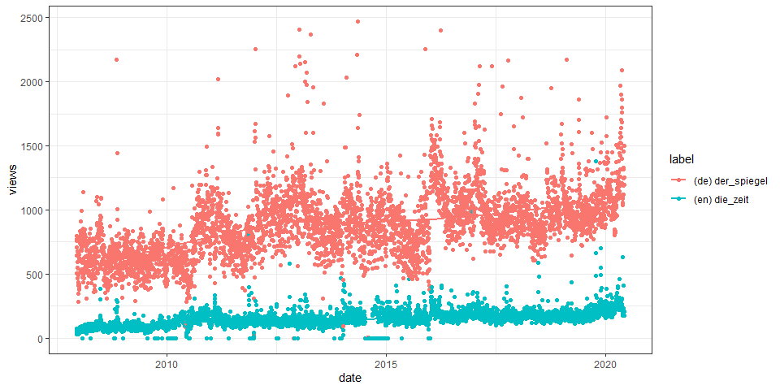

<!-- README.md is generated from README.Rmd. Please edit that file -->

# Public Subject Attention via Wikipedia Page View Statistics

**Status**

<a href="https://travis-ci.org/petermeissner/wikipediatrend"><a/>
[](https://ci.appveyor.com/project/petermeissner/wikipediatrend)
<a href="https://codecov.io/gh/petermeissner/wikipediatrend"></a>
<a href="https://cran.r-project.org/package=wikipediatrend">
 </a>


*lines of R code:* 474, *lines of test code:* 160

**Version**

2.1.5 ( 2020-04-13 13:01:13 )

**Description**

**License**

GPL (\>= 2) <br>Peter Meissner \[aut, cre\], R Core Team \[cph\]

**Credits**

  - Parts of the package’s code have been shamelessly copied and
    modified from R base package written by R core team. This concerns
    the `wp_date()` generic and its methods and is detailed in the help
    files.

**Citation**

``` r
citation("wikipediatrend")
```

Meissner P (2020). *wikipediatrend: Public Subject Attention via
Wikipedia Page View Statistics*. R package version 2.1.5.

**BibTex for citing**

``` r
toBibtex(citation("wikipediatrend"))
```

**Installation**

Stable version from CRAN:

``` r
install.packages("wikipediatrend")
```

Latest development version from Github:

``` r
devtools::install_github("petermeissner/wikipediatrend")
```

**Usage**

*starting up …*

``` r
library(wikipediatrend)
```

    ## 
    ##   [wikipediatrend]
    ##     
    ##   Note:
    ##     
    ##     - Data before 2016-01-01 
    ##       * is provided by petermeissner.de and
    ##       * was prepared in a project commissioned by the Hertie School of Governance (Prof. Dr. Simon Munzert)
    ##       * and supported by the Daimler and Benz Foundation.
    ##     
    ##     - Data from 2016-01-01 onwards 
    ##       * is provided by the Wikipedia Foundation
    ##       * via its pageviews package and API.
    ## 

*getting some data …*

``` r
trend_data <- 
  wp_trend(
    page = c("Der_Spiegel", "Die_Zeit"), 
    lang = c("de", "en"), 
    from = "2007-01-01",
    to   = Sys.Date()
  )
```

*having a look …*

``` r
trend_data
```

    ##      language article     date       views
    ## 2    en       die_zeit    2007-12-10    74
    ## 1    de       der_spiegel 2007-12-10   798
    ## 4    en       die_zeit    2007-12-11    35
    ## 3    de       der_spiegel 2007-12-11   710
    ## 5    de       der_spiegel 2007-12-12   770
    ## 9020 en       die_zeit    2020-04-14   276
    ## 9022 en       die_zeit    2020-04-15   259
    ## 9021 de       der_spiegel 2020-04-15  1292
    ## 9024 en       die_zeit    2020-04-16   243
    ## 9023 de       der_spiegel 2020-04-16  1090
    ## 
    ## ... 9014 rows of data not shown

*having another look …*

``` r
plot(
  trend_data[trend_data$views < 2500, ]
)
```

<!-- -->

**Usage 2**

*getting some data …*

``` r
trend_data <- 
  wp_trend(
    page = 
      c(
        "Climate_crisis", 
        "2019–20_coronavirus_pandemic",
        "Donald_Trump",
        "Syria",
        "Crimea",
        "Influenza"
      ), 
    lang = "en", 
    from = "2007-01-01",
    to   = Sys.Date()
  )
```

    ## Warning in wpd_get_exact(page = page, lang = lang, from = from, to = to, : Unable to retrieve data for url:
    ## http://petermeissner.de:8880/article/exact/en/2019–20_coronavirus_pandemic. Status: error.

*having a look …*

``` r
trend_data
```

    ##       language article        date       views  
    ## 1     en       climate_crisis 2007-12-10       0
    ## 2     en       crimea         2007-12-10    1051
    ## 5     en       syria          2007-12-10    3205
    ## 4     en       influenza      2007-12-10    4153
    ## 3     en       donald_trump   2007-12-10    5050
    ## 22447 en       climate_crisis 2020-04-17     151
    ## 22448 en       crimea         2020-04-17    3201
    ## 22451 en       syria          2020-04-17    6339
    ## 22450 en       influenza      2020-04-17   11628
    ## 22449 en       donald_trump   2020-04-17  772260
    ## 
    ## ... 22441 rows of data not shown

*having another look …*

``` r
options(scipen = 1000000)

plot(trend_data) + 
  ggplot2::scale_y_log10()
```

    ## Warning: Transformation introduced infinite values in continuous y-axis
    
    ## Warning: Transformation introduced infinite values in continuous y-axis

    ## Warning: Removed 1202 rows containing non-finite values (stat_smooth).

<!-- -->
