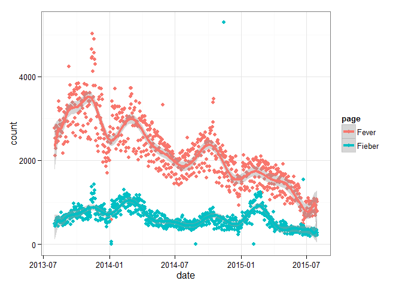
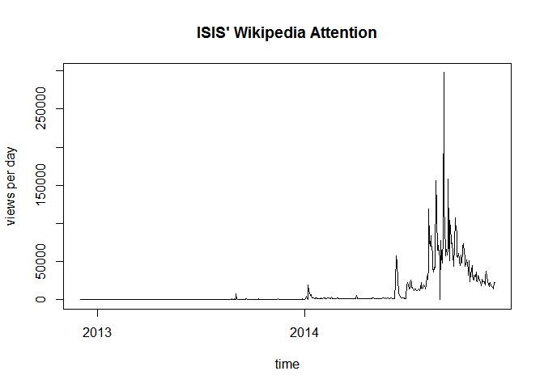

# wikipediatrend

# Author

Peter Meißner


# Last Update

2015-09-22


# Status

<table>
<tr>
<td> 
Ubuntu build </td>
<td> 

</td>
</tr>
<tr>
<td> 
Windows build
</td>
<td> 

</td>
</tr>
<tr>
<td> 
Code covered by tests
</td>
<td> 

</td>
</tr>
<tr>
<td>
Version on CRAN  
</td> 
<td>

</td>
</tr>
<tr>
<td>
Version on Github
</td> 
<td>
      1.1.6.900000
</td>
</tr>

<tr>
<td>
Downloads from <a href='http://cran.rstudio.com/'>CRAN.RStudio</a>&nbsp;&nbsp;&nbsp;
</td>
<td>


</td>
</tr>

</table>


# Purpose

The wikipediatrend package is designed to make Wikipedia page access statistics data availible in R in a most convenient way. 

*Consequently the package provides* 

- daily page views as data frames 
- page views for user set time spans
- page views for multiple articles in one function call
- page views for articles in different language domains
- a function to check article titles in other country domains
- background caching of results to minimize function execution time as well as server burdens


# Installation 

A stable version of the package can be found on CRAN and installed via ...

```r
install.packages("wikipediatrend")
```

... while the current developement version can be retrieved by using `install_github()` from the devtools package ... 


```r
devtools::install_github("petermeissner/wikipediatrend")
```

After loading the package several functions are available.


```r
library(wikipediatrend)
```


# Usage


The workhorse of the package is the `wp_trend()` function:


```r
wp <- wp_trend(page = c("Fever","Fieber"), 
               from = "2013-08-01", 
               to   = prev_month_end(), 
               lang = c("en","de"))
```

```
## http://stats.grok.se/json/en/201308/Fever
## http://stats.grok.se/json/en/201309/Fever
## http://stats.grok.se/json/en/201310/Fever
## http://stats.grok.se/json/en/201311/Fever
## http://stats.grok.se/json/en/201312/Fever
## http://stats.grok.se/json/en/201401/Fever
## http://stats.grok.se/json/en/201402/Fever
## http://stats.grok.se/json/en/201403/Fever
## http://stats.grok.se/json/en/201404/Fever
## http://stats.grok.se/json/en/201405/Fever
## http://stats.grok.se/json/en/201406/Fever
## http://stats.grok.se/json/en/201407/Fever
## http://stats.grok.se/json/en/201408/Fever
## http://stats.grok.se/json/en/201409/Fever
## http://stats.grok.se/json/en/201410/Fever
## http://stats.grok.se/json/en/201411/Fever
## http://stats.grok.se/json/en/201412/Fever
## http://stats.grok.se/json/en/201501/Fever
## http://stats.grok.se/json/en/201502/Fever
## http://stats.grok.se/json/en/201503/Fever
## http://stats.grok.se/json/en/201504/Fever
## http://stats.grok.se/json/en/201505/Fever
## http://stats.grok.se/json/en/201506/Fever
## http://stats.grok.se/json/en/201507/Fever
## http://stats.grok.se/json/de/201308/Fieber
## http://stats.grok.se/json/de/201309/Fieber
## http://stats.grok.se/json/de/201310/Fieber
## http://stats.grok.se/json/de/201311/Fieber
## http://stats.grok.se/json/de/201312/Fieber
## http://stats.grok.se/json/de/201401/Fieber
## http://stats.grok.se/json/de/201402/Fieber
## http://stats.grok.se/json/de/201403/Fieber
## http://stats.grok.se/json/de/201404/Fieber
## http://stats.grok.se/json/de/201405/Fieber
## http://stats.grok.se/json/de/201406/Fieber
## http://stats.grok.se/json/de/201407/Fieber
## http://stats.grok.se/json/de/201408/Fieber
## http://stats.grok.se/json/de/201409/Fieber
## http://stats.grok.se/json/de/201410/Fieber
## http://stats.grok.se/json/de/201411/Fieber
## http://stats.grok.se/json/de/201412/Fieber
## http://stats.grok.se/json/de/201501/Fieber
## http://stats.grok.se/json/de/201502/Fieber
## http://stats.grok.se/json/de/201503/Fieber
## http://stats.grok.se/json/de/201504/Fieber
## http://stats.grok.se/json/de/201505/Fieber
## http://stats.grok.se/json/de/201506/Fieber
## http://stats.grok.se/json/de/201507/Fieber
```

The function's return is a data frame with six variables *date*, *count*, *project*, *title*, *rank*, *month* paralleling the data provided by the stats.grok.se server:


```r
head(wp)
```

```
##   date       count lang page  rank month  title
## 1 2013-08-26 2993  en   Fever 5014 201308 Fever
## 2 2013-08-27 3153  en   Fever 5014 201308 Fever
## 3 2013-08-28 2984  en   Fever 5014 201308 Fever
## 4 2013-08-19 3229  en   Fever 5014 201308 Fever
## 5 2013-08-18 2700  en   Fever 5014 201308 Fever
## 6 2013-08-31 2441  en   Fever 5014 201308 Fever
```


```r
library(ggplot2)

ggplot(wp, aes(date, count, group=page, color = page)) + 
  geom_point() +
  geom_smooth(method="lm", formula = y ~ poly(x, 20), size=1.5) +
  theme_bw()
```

 


# Vignette

*For a more detailed usage have a look at the vignette accompanying the package. `vignette("using-wikipediatrend", package="wikipediatrend")`*

... or GoTo [CRAN](http://cran.r-project.org/web/packages/wikipediatrend/index.html) or build it from scratch from [Github](https://raw.githubusercontent.com/petermeissner/wikipediatrend/master/vignettes/using-wikipediatrend.Rmd).


# Some examples for using page view statistics


- Wilkerson, Bill (2015): *Post-Republican debate on Wikipedia follow-up: before and after public interest in the candidates* http://www.wrwilkerson.com/ . 
http://www.wrwilkerson.com/blog/2015/8/15/post-republican-debate-on-wikipedia-follow-up-before-and-after-public-interest-in-the-candidates

- Mellon, Jonathan (2014) *Internet Search Data and Issue Salience: The Properties of Google Trends as a Measure of Issue Salience* Journal of Elections, Public Opinion and Parties 24(1):45-72.
http://www.tandfonline.com/doi/abs/10.1080/17457289.2013.846346 

- Ripberger, Joseph T. (2011): *Capturing curiosity: using Internet search trends to measure public attentiveness*. Policy Studies Journal 39(2):239-259.
http://onlinelibrary.wiley.com/doi/10.1111/j.1541-0072.2011.00406.x/full

- Yla Tausczik, Kate Faasse, James W. Pennebaker, Keith J. Petrie (2012): *Public Anxiety and Information Seeking Following the H1N1 Outbreak: Blogs, Newspaper Articles, and Wikipedia Visits*. Health Communication, Vol. 27, Iss. 2.
 http://www.tandfonline.com/doi/pdf/10.1080/10410236.2011.571759

- Taha Yasseri and Jonathan Bright (2015): *Predicting elections from online information flows: towards theoretically informed models*. http://arxiv.org/abs/1505.01818

 
*(I missed your application? Let me know and I put it here)*


# Thanks 

Fernando Reis, Eryk Walczak, Simon Munzert, Kristin Lindemann


# Credits

- Parts of the package's code have been shamelessly copied and modified from R base package written by R core team. This concerns the `wp_date()` generic and its methods and is detailed in the help files. 


# Meta ([cranlogs](https://github.com/metacran/cranlogs)) wikipediatrend


```r
library(cranlogs)
plot(
  cran_downloads(
    package = "wikipediatrend", 
    from = "2014-01-01", 
    to = Sys.Date()
  )[,1:2], 
  type="l"
)
```

 


