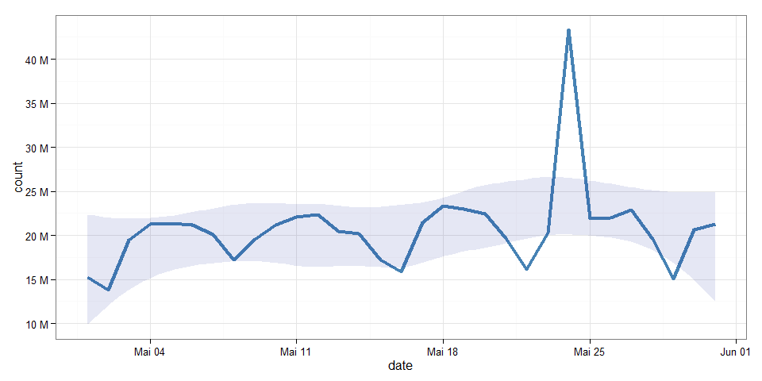
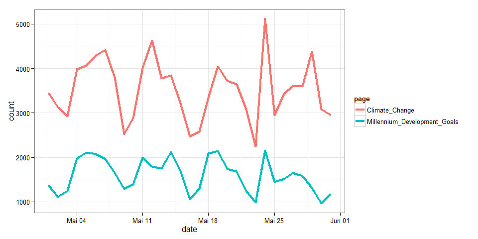
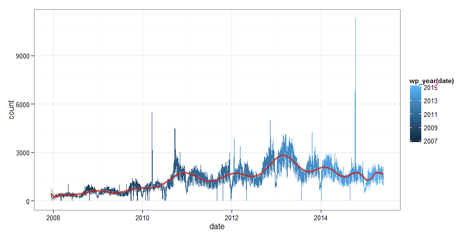
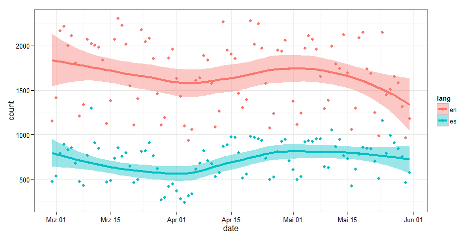
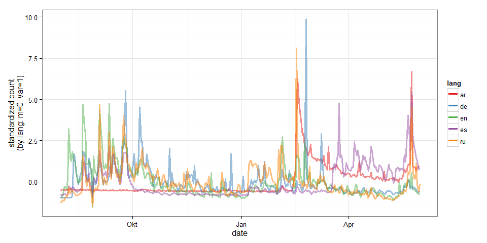
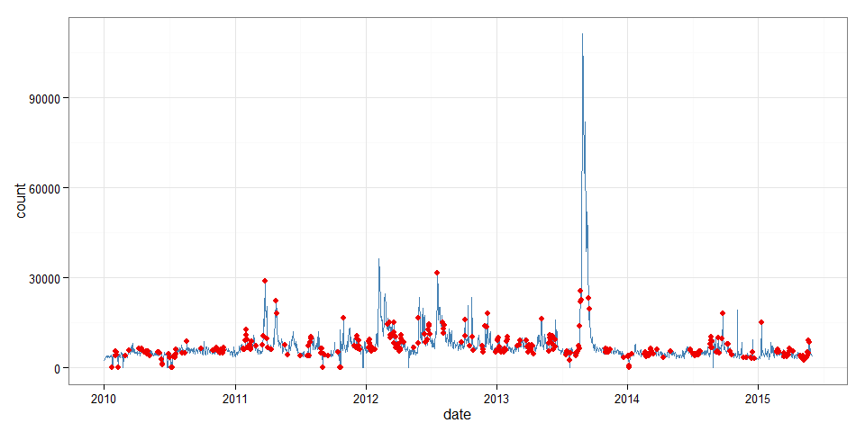
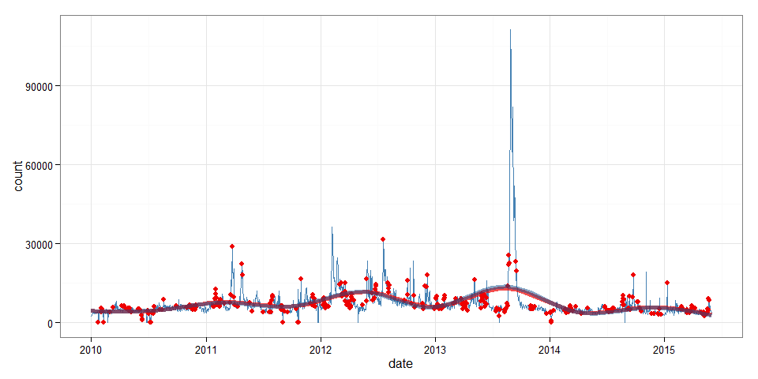
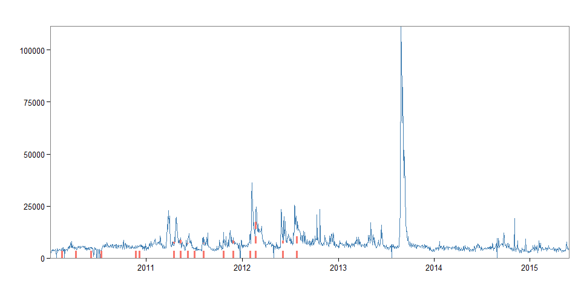
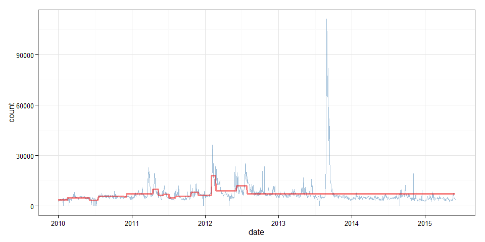

# Using Wikipediatrend
Peter Meißner  
`r Sys.Date()`  


> What do Wikipedia's readers care about? Is Britney Spears more popular than Brittany? Is Asia Carrera more popular than Asia? How many people looked at the article on Santa Claus in December? How many looked at the article on Ron Paul?
> <br> What can you find?
> <br> *Source:* http://stats.grok.se/ 


The *wikipediatrend* package provides convenience
access to daily page view counts (*Wikipedia article traffic statistics*)
stored at http://stats.grok.se/ . 

If you want to know how often an article has been viewed over time and 
work with the data from within R, this package is for you. 
Maybe you want to compare how much attention articles from different languages got and when, 
this package is for you.
Are you up to policy studies or epidemiology? Have a look at page counts for *Flue*, *Ebola*, *Climate Change* or
*Millennium Development Goals* and maybe build a model or two. Again, this package is for you. 

If you simply want to browse Wikipedia page view statistics without all that coding,
visit http://stats.grok.se/ and have a look around. 

If non-big data is not an option, get the raw data in their entity at 
http://dumps.wikimedia.org/other/pagecounts-raw/ . 

If you think days are crude measures of time but seconds might do if need be and info about which article views led to the numbers is useless anyways - go to http://datahub.io/dataset/english-wikipedia-pageviews-by-second. 

To get further information on the data source (Who? When? How? How good?) there is a Wikipedia article for that: http://en.wikipedia.org/wiki/Wikipedia:Pageview_statistics and another one: http://en.wikipedia.org/wiki/Wikipedia:About_page_view_statistics .


# Installation


**stable CRAN version** (http://cran.rstudio.com/web/packages/wikipediatrend/)


```r
install.packages("wikipediatrend")
```


**developemnt version** (https://github.com/petermeissner/wikipediatrend)


```r
devtools::install_github("petermeissner/wikipediatrend")
```


**... and load it via:**


```r
library(wikipediatrend)
```


# A first try

The workhorse of the package is the `wp_trend()` function that allows you to get page 
view counts as neat data frames like this:


```r
page_views <- wp_trend("main_page")
    
page_views
```

```
##    date       count    lang page      rank month  title    
## 3  2015-05-01 15195088 en   Main_page 2    201505 Main_page
## 2  2015-05-02 13800408 en   Main_page 2    201505 Main_page
## 1  2015-05-03 19462469 en   Main_page 2    201505 Main_page
## 7  2015-05-04 21295053 en   Main_page 2    201505 Main_page
## 6  2015-05-05 21338940 en   Main_page 2    201505 Main_page
## 5  2015-05-06 21198056 en   Main_page 2    201505 Main_page
## 4  2015-05-07 20128000 en   Main_page 2    201505 Main_page
## 11 2015-05-08 17191834 en   Main_page 2    201505 Main_page
## 10 2015-05-09 19560505 en   Main_page 2    201505 Main_page
## 26 2015-05-10 21168444 en   Main_page 2    201505 Main_page
## 27 2015-05-11 22101221 en   Main_page 2    201505 Main_page
## 28 2015-05-12 22320344 en   Main_page 2    201505 Main_page
## 29 2015-05-13 20420337 en   Main_page 2    201505 Main_page
## 22 2015-05-14 20174520 en   Main_page 2    201505 Main_page
## 23 2015-05-15 17176625 en   Main_page 2    201505 Main_page
## 24 2015-05-16 15845474 en   Main_page 2    201505 Main_page
## 25 2015-05-17 21462364 en   Main_page 2    201505 Main_page
## 20 2015-05-18 23386371 en   Main_page 2    201505 Main_page
## 21 2015-05-19 22999646 en   Main_page 2    201505 Main_page
## 9  2015-05-20 22486802 en   Main_page 2    201505 Main_page
## 8  2015-05-21 19693422 en   Main_page 2    201505 Main_page
## 19 2015-05-22 16096041 en   Main_page 2    201505 Main_page
## 13 2015-05-24 43322132 en   Main_page 2    201505 Main_page
## 12 2015-05-25 21908990 en   Main_page 2    201505 Main_page
## 15 2015-05-26 21954108 en   Main_page 2    201505 Main_page
## 14 2015-05-27 22918926 en   Main_page 2    201505 Main_page
## 16 2015-05-28 19572988 en   Main_page 2    201505 Main_page
## 31 2015-05-29 15049919 en   Main_page 2    201505 Main_page
## 30 2015-05-30 20611835 en   Main_page 2    201505 Main_page
## 
## ... 2 rows of data not shown
```

... that can easily be turned into a plot ... 


```r
library(ggplot2)

ggplot(page_views, aes(x=date, y=count)) + 
  geom_line(size=1.5, colour="steelblue") + 
  geom_smooth(method="loess", colour="#00000000", fill="#001090", alpha=0.1) +
  scale_y_continuous( breaks=seq(5e6, 50e6, 5e6) , 
  label= paste(seq(5,50,5),"M") ) +
  theme_bw()
```

 


# `wp_trend()` options

`wp_trend()` has several options and most of them are set to defaults: 

- `page`
- `from = Sys.Date() - 30`
- `to   = Sys.Date()`
- `lang = "en"`
- `file = ""`
- ~~`friendly`~~ *deprecated*
- ~~`requestFrom`~~ *deprecated*
- ~~`userAgent`~~ *deprecated*

## `page`

The `page` option allows to specify one or more article titles for which data should be retrieved. 

These titles should be in the same format as shown in the address bar of your browser to ensure that the pages are found. 
If we want to get page views for the United Nations Millennium Development Goals and 
the article is found here:  *"http://en.wikipedia.org/wiki/Millennium_Development_Goals"* the page title to pass to `wp_trend()` should be *Millennium_Development_Goals* not *Millennium Development Goals* or *Millennium_development_goals* or amy other *'mostly-like-the-original'* variation. 

To ease data gathering `wp_trend()` `page` accepts whole vectors of page  titles and will retrieve date for each one after another. 


```r
page_views <- 
  wp_trend( 
    page = c( "Millennium_Development_Goals", "Climate_Change") 
  )
```


```r
library(ggplot2)

ggplot(page_views, aes(x=date, y=count, group=page, color=page)) + 
  geom_line(size=1.5) + theme_bw()
```

 


## `from` and `to`

These two options determine the time frame for which data shall be retrieved. The defaults are set to gather the last 30 days but might be set to cover larger time frames as well. Note that there is no data prior to December 2007 so that any date prior will be set to this minimum. 


```r
page_views <- 
  wp_trend( 
    page = "Millennium_Development_Goals" ,
    from = "2000-01-01",
    to   = prev_month_end()
  )
```


```r
library(ggplot2)

ggplot(page_views, aes(x=date, y=count, color=wp_year(date))) + 
  geom_line() + 
  stat_smooth(method = "lm", formula = y ~ poly(x, 22), color="#CD0000a0", size=1.2) +
  theme_bw() 
```

 


## `lang`

This option determines for which Wikipedia the page views shall be retrieved, English, German, Chinese, Spanish, ... . The default is set to `"en"` for the English Wikipedia. This option should get one language shorthand that then is used for all pages or for each page a corresponding language shorthand should be specified. 


```r
page_views <- 
  wp_trend( 
    page = c("Objetivos_de_Desarrollo_del_Milenio", "Millennium_Development_Goals") ,
    lang = c("es", "en"),
    from = Sys.Date()-100
  )
```


```r
library(ggplot2)

ggplot(page_views, aes(x=date, y=count, group=lang, color=lang, fill=lang)) + 
  geom_smooth(size=1.5) + 
  geom_point() +
  theme_bw() 
```

 


## `file`

This last option allows for storing the data retrieved by a call to `wp_trend()`
in a file, e.g. `file = "MyCache.csv"`. While `MyCache.csv` will be created if it 
does not exist already it will never be overwritten by `wp_trend()` thus allowing 
to accumulate data from susequent calls to `wp_trend()`. To get the data stored 
back into R use `wp_load(file = "MyCache.csv")`.


```r
wp_trend("Cheese", file="cheeeeese.csv")
wp_trend("Käse", lang="de", file="cheeeeese.csv")

cheeeeeese <- wp_load( file="cheeeeese.csv" )
cheeeeeese
```

```
##    date       count lang page      rank month  title 
## 34 2015-05-01  275  de   K%C3%A4se 6057 201505 Käse  
## 32 2015-05-03  261  de   K%C3%A4se 6057 201505 Käse  
## 38 2015-05-04  297  de   K%C3%A4se 6057 201505 Käse  
## 36 2015-05-06  326  de   K%C3%A4se 6057 201505 Käse  
## 57 2015-05-10  239  de   K%C3%A4se 6057 201505 Käse  
## 58 2015-05-11  297  de   K%C3%A4se 6057 201505 Käse  
## 59 2015-05-12  356  de   K%C3%A4se 6057 201505 Käse  
## 60 2015-05-13  332  de   K%C3%A4se 6057 201505 Käse  
## 39 2015-05-21  366  de   K%C3%A4se 6057 201505 Käse  
## 50 2015-05-22  236  de   K%C3%A4se 6057 201505 Käse  
## 44 2015-05-24  450  de   K%C3%A4se 6057 201505 Käse  
## 43 2015-05-25  295  de   K%C3%A4se 6057 201505 Käse  
## 45 2015-05-27  308  de   K%C3%A4se 6057 201505 Käse  
## 47 2015-05-28  313  de   K%C3%A4se 6057 201505 Käse  
## 62 2015-05-29  301  de   K%C3%A4se 6057 201505 Käse  
## 1  2015-05-03 1642  en   Cheese    705  201505 Cheese
## 6  2015-05-05 2053  en   Cheese    705  201505 Cheese
## 4  2015-05-07 2983  en   Cheese    705  201505 Cheese
## 11 2015-05-08 2015  en   Cheese    705  201505 Cheese
## 10 2015-05-09 4963  en   Cheese    705  201505 Cheese
## 23 2015-05-15 1756  en   Cheese    705  201505 Cheese
## 25 2015-05-17 1421  en   Cheese    705  201505 Cheese
## 20 2015-05-18 1809  en   Cheese    705  201505 Cheese
## 9  2015-05-20 1947  en   Cheese    705  201505 Cheese
## 15 2015-05-26 1877  en   Cheese    705  201505 Cheese
## 14 2015-05-27 1917  en   Cheese    705  201505 Cheese
## 16 2015-05-28 2029  en   Cheese    705  201505 Cheese
## 30 2015-05-30 1413  en   Cheese    705  201505 Cheese
## 17 2015-05-31 1481  en   Cheese    705  201505 Cheese
## 
## ... 33 rows of data not shown
```


# Caching

## Session caching

When using `wp_trend()` you will notice that subsequent calls to the function 
might take considerably less time than previous calls - given that later 
calls include data that has been downloaded already. This is due to the caching
system running in the background and keeping track of things downloaded already. 
You can see if `wp_trend()` had to download something if it reports one or more 
links to the stats.grok.se server, e.g. ... 


```r
wp_trend("Cheese")
```

```
## http://stats.grok.se/json/en/201505/Cheese
```

```r
wp_trend("Cheese")
```
... but ... 


```r
wp_trend("Cheese", from = Sys.Date()-60)
```

```
## http://stats.grok.se/json/en/201504/Cheese
```

The current cache in memory can be accessed via:


```r
wp_get_cache()
```

```
##      date       count    lang page             rank month 
## 2965 2014-12-22    19833 en   Islamic_Stat ... -1   201412
## 763  2008-04-23      473 en   Millennium_D ... 7435 200804
## 1207 2009-07-15      488 en   Millennium_D ... 7435 200907
## 1268 2009-09-17      899 en   Millennium_D ... 7435 200909
## 1469 2010-04-04      554 en   Millennium_D ... 7435 201004
## 1712 2010-12-18      829 en   Millennium_D ... 7435 201012
## 2021 2011-10-17     1977 en   Millennium_D ... 7435 201110
## 2054 2011-11-19     1142 en   Millennium_D ... 7435 201111
## 2146 2012-02-19     1375 en   Millennium_D ... 7435 201202
## 2314 2012-08-19     1010 en   Millennium_D ... 7435 201208
## 2333 2012-08-21     1481 en   Millennium_D ... 7435 201208
## 2345 2012-09-03     1702 en   Millennium_D ... 7435 201209
## 2678 2013-08-19     1950 en   Millennium_D ... 7435 201308
## 2778 2013-11-02     1423 en   Millennium_D ... 7435 201311
## 2813 2013-12-06     2263 en   Millennium_D ... 7435 201312
## 269  2014-06-29     1000 en   Millennium_D ... 7435 201406
## 448  2014-12-13      994 en   Millennium_D ... 7435 201412
## 6200 2015-05-29     1311 en   Millennium_D ... 7435 201505
## 4248 2010-02-10     4415 en   Syria            1802 201002
## 4232 2010-02-21     3856 en   Syria            1802 201002
## 4783 2011-08-16     7471 en   Syria            1802 201108
## 5066 2012-05-10     7631 en   Syria            1802 201205
## 5098 2012-06-11    10616 en   Syria            1802 201206
## 5430 2013-05-04     9450 en   Syria            1802 201305
## 5823 2014-06-04     5082 en   Syria            1802 201406
## 5847 2014-07-28     5104 en   Syria            1802 201407
## 5881 2014-08-04     5876 en   Syria            1802 201408
## 3970 2014-09-09     4769 ru   %D0%98%D1%81 ... -1   201409
## 4060 2014-12-18     2527 ru   %D0%98%D1%81 ... -1   201412
##      title           
## 2965 Islamic_Stat ...
## 763  Millennium_D ...
## 1207 Millennium_D ...
## 1268 Millennium_D ...
## 1469 Millennium_D ...
## 1712 Millennium_D ...
## 2021 Millennium_D ...
## 2054 Millennium_D ...
## 2146 Millennium_D ...
## 2314 Millennium_D ...
## 2333 Millennium_D ...
## 2345 Millennium_D ...
## 2678 Millennium_D ...
## 2778 Millennium_D ...
## 2813 Millennium_D ...
## 269  Millennium_D ...
## 448  Millennium_D ...
## 6200 Millennium_D ...
## 4248 Syria           
## 4232 Syria           
## 4783 Syria           
## 5066 Syria           
## 5098 Syria           
## 5430 Syria           
## 5823 Syria           
## 5847 Syria           
## 5881 Syria           
## 3970 <U+0418><U+0441><U+043B><U+0430><U+043C><U+0441><U+043A><U+043E><U+0435>_<U+0433><U+043E> ...
## 4060 <U+0418><U+0441><U+043B><U+0430><U+043C><U+0441><U+043A><U+043E><U+0435>_<U+0433><U+043E> ...
## 
## ... 6294 rows of data not shown
```

... and emptied by a call to `wp_cache_reset()`.


## Caching across sessions 1

While everything that is downloaded during a session is cached in memory it might come handy to save the cache parallel on disk to reuse it in the next R session.  To activate disk-caching for a session simply use:


```r
wp_set_cache_file( file = "myCache.csv" )
```

The function will reload whatever is stored in the file and in subsequent calls to 
`wp_trend()` will automatically add data as it is downloaded. The file used for disk-caching can be changed by another call to `wp_set_cache_file( file = "myOtherCache.csv")` or turned off completely by leaving the `file` argument empty. 


## Caching across sessions 2

If disk-caching should be enabled by default one can define a path as system/environment variable `WP_CACHE_FILE`. When loading the package it will look for this variable via `Sys.getenv("WP_CACHE_FILE")` and use the path for caching 
as if ...


```r
wp_set_cache_file( Sys.getenv("WP_CACHE_FILE") )
```

.. would have been typed in by the user. 


# Counts for other languages

If comparing languages is important one needs to specify the exact article titles for each language: While the article about the Millennium Goals has an English title in the English Wikipedia, it of course is named differently in Spanish, German, Chinese, ... . One might look these titles up by hand or use the handy `wp_linked_pages()` function like this:


```r
titles <- wp_linked_pages("Islamic_State_of_Iraq_and_the_Levant", "en")
titles <- titles[titles$lang %in% c("en", "de", "es", "ar", "ru"),]
titles 
```

```
##   page             lang title           
## 1 Islamic_Stat ... en   Islamic_Stat ...
## 2 %D8%AF%D8%A7 ... ar   <U+062F><U+0627><U+0639><U+0634>
## 3 Islamischer_ ... de   Islamischer_ ...
## 4 Estado_Isl%C ... es   Estado_Islám ...
## 5 %D0%98%D1%81 ... ru   <U+0418><U+0441><U+043B><U+0430><U+043C><U+0441><U+043A><U+043E><U+0435>_<U+0433><U+043E> ...
```

... then we can use the information to get data for several languages ... 


```r
page_views <- 
  wp_trend(
    page = titles$page[1:5], 
    lang = titles$lang[1:5],
    from = "2014-08-01"
  )
```


```r
library(ggplot2)

for(i in unique(page_views$lang) ){
  iffer <- page_views$lang==i
  page_views[iffer, ]$count <- scale(page_views[iffer, ]$count)
}

ggplot(page_views, aes(x=date, y=count, group=lang, color=lang)) + 
  geom_line(size=1.2, alpha=0.5) + 
  ylab("standardized count\n(by lang: m=0, var=1)") +
  theme_bw() + 
  scale_colour_brewer(palette="Set1") + 
  guides(colour = guide_legend(override.aes = list(alpha = 1)))
```

 


# Going beyond Wikipediatrend -- Anomalies and mean shifts 


## Identifying anomalies with `AnomalyDetection` 

Currently the `AnomalyDetection` package is not availible on CRAN so we have to use `install_github()` from the `devtools` package to get it. 


```r
# install.packages( "AnomalyDetection", repos="http://ghrr.github.io/drat",  type="source")
library(AnomalyDetection)
library(dplyr)
```

```
## 
## Attaching package: 'dplyr'
## 
## The following objects are masked from 'package:stats':
## 
##     filter, lag
## 
## The following objects are masked from 'package:base':
## 
##     intersect, setdiff, setequal, union
```

```r
library(ggplot2)
```

The package is a little picky about the data it accepts for processing so we 
have to build a new data frame. It should contain only the date and count variable.
Furthermore, `date` should be named `timestamp` and transformed to type `POSIXct`.


```r
page_views <- wp_trend("Syria", from = "2010-01-01")
```

```
## http://stats.grok.se/json/en/201505/Syria
```

```r
page_views_br <- 
  page_views  %>% 
  select(date, count)  %>% 
  rename(timestamp=date)  %>% 
  unclass()  %>% 
  as.data.frame() %>% 
  mutate(timestamp = as.POSIXct(timestamp))
```

Having transformed the data we can detect anomalies via `AnomalyDetectionTs()`. 
The function offers various options e.g. the significance level for rejecting 
normal values (`alpha`); the maximum fraction of the data that is allowed to be 
detected as anomalies (`max_amoms`); whether or not upward deviations, downward 
devaitions or irregularities in both directions might form the basis of anomaly 
detection (`direction`) and last but not least whether or not the time frame for 
detection is larger than one month (`lonterm`).

Lets choose a greedy set of parameters and detect possible anomalies:


```r
res <- 
AnomalyDetectionTs(
  x         = page_views_br, 
  alpha     = 0.05, 
  max_anoms = 0.40,
  direction = "both",
  longterm  = T
)$anoms

res$timestamp <- as.Date(res$timestamp)

head(res)
```

```
##    timestamp anoms
## 1 2010-02-02  5567
## 2 2010-02-04  5191
## 3 2010-01-23     0
## 4 2010-02-03  4322
## 5 2010-02-01  3918
## 6 2010-02-08     0
```

... and play back the detected anomalies to our `page_views` data set:


```r
page_views <- 
  page_views  %>% 
  mutate(normal = !(page_views$date %in% res$timestamp))  %>% 
  mutate(anom   =   page_views$date %in% res$timestamp )

class(page_views) <- c("wp_df", "data.frame")
```

Now we can plot counts and anomalies ... 


```r
(
  p <-
    ggplot( data=page_views, aes(x=date, y=count) ) + 
      geom_line(color="steelblue") +
      geom_point(data=filter(page_views, anom==T), color="red2", size=2) +
      theme_bw()
)
```

 

... as well as compare running means: 


```r
p + 
  geom_line(stat = "smooth", size=2, color="red2", alpha=0.7) + 
  geom_line(data=filter(page_views, anom==F), 
  stat = "smooth", size=2, color="dodgerblue4", alpha=0.5) 
```

 

It seems like upward and downward anomalies partial each other out most of the 
time since both smooth lines (with and without anomalies) do not differ much. 
Nonetheless, keeping anomalies in will upward bias the counts slightly, so we 
proceed with a cleaned up data set: 


```r
page_views_clean <- 
  page_views  %>% 
  filter(anom==F)  %>% 
  select(date, count, lang, page, rank, month, title)

page_views_br_clean <- 
  page_views_br  %>% 
  filter(page_views$anom==F)
```


## Identifying mean shifts with `BreakoutDetection` 

`BreakoutDetection` is a package that allows to search data for mean level shifts
by dividing it into timespans of change and those of stability in the presence 
of seasonal noise. 
Similar to `AnomalyDetection` the `BreakoutDetection` package is not available 
on CRAN but has to be obtained from Github. 


```r
# install.packages(  "BreakoutDetection",   repos="http://ghrr.github.io/drat", type="source")
library(BreakoutDetection)
library(dplyr)
library(ggplot2)
library(magrittr)
```

... again the workhorse function (`breakout()`) is picky and requires *"a data.frame which has 'timestamp' and 'count' components"* like our `page_views_br_clean`. 

The function has two general options: one tweaks the minimum length of a timespan 
(`min.size`); the other one does determine how many mean level changes might 
occur during the whole time frame (`method`); and several method specific 
options, e.g. `decree`, `beta`, and `percent` which control the sensitivity 
adding further breakpoints. In the following case the last option tells 
the function that overall model fit should be increased by at least 5 percent 
if adding a breakpoint. 


```r
br <- 
  breakout(
    page_views_br_clean, 
    min.size = 30, 
    method   = 'multi', 
    percent  = 0.05,
    plot     = TRUE
  )
br
```

```
## $loc
##  [1]  53 105 137 174 263 306 389 426 458 488 518 566 601 640 670 751 784
## 
## $time
## [1] 1.19
## 
## $pval
## [1] NA
## 
## $plot
```

 

In the following snippet we combine the break information with our page views data and can have a look at the dates at which the breaks occured. 


```r
breaks <- page_views_clean[br$loc,]
breaks
```

```
##           date count lang  page rank  month title
## 53  2010-02-13  3327   en Syria 1802 201002 Syria
## 105 2010-04-08  5210   en Syria 1802 201004 Syria
## 137 2010-06-03  5176   en Syria 1802 201006 Syria
## 174 2010-07-14  3874   en Syria 1802 201007 Syria
## 263 2010-11-22  6090   en Syria 1802 201011 Syria
## 306 2010-12-05  6182   en Syria 1802 201012 Syria
## 389 2011-04-15  6113   en Syria 1802 201104 Syria
## 426 2011-05-12  8217   en Syria 1802 201105 Syria
## 458 2011-06-07  9442   en Syria 1802 201106 Syria
## 488 2011-07-04  4745   en Syria 1802 201107 Syria
## 518 2011-08-07  7506   en Syria 1802 201108 Syria
## 566 2011-10-22  7449   en Syria 1802 201110 Syria
## 601 2011-11-27  8492   en Syria 1802 201111 Syria
## 640 2012-01-31 11496   en Syria 1802 201201 Syria
## 670 2012-02-22 23197   en Syria 1802 201202 Syria
## 751 2012-06-04  9461   en Syria 1802 201206 Syria
## 784 2012-07-27 17383   en Syria 1802 201207 Syria
```

Next, we add a span variable capturing which page_view observations belong to 
which span, allowing us to aggregate data. 


```r
page_views_clean$span <- 0
for (d in breaks$date ) {
  page_views_clean$span[ page_views_clean$date > d ] %<>% add(1)
}

page_views_clean$mcount <- 0
for (s in unique(page_views_clean$span) ) {
  iffer <- page_views_clean$span == s
page_views_clean$mcount[ iffer ] <- mean(page_views_clean$count[iffer])
}

spans <- 
  page_views_clean  %>% 
  as_data_frame() %>% 
  group_by(span) %>% 
  summarize(
    start      = min(date), 
    end        = max(date), 
    length     = end-start,
    mean_count = round(mean(count)),
    min_count  = min(count),
    max_count  = max(count),
    var_count  = var(count)
  )
spans
```

```
## Source: local data frame [18 x 8]
## 
##    span      start        end length mean_count min_count max_count
## 1     0 2010-01-01 2010-02-13     43       3662         0      4734
## 2     1 2010-02-14 2010-04-08     53       4768         0      8179
## 3     2 2010-04-10 2010-06-03     54       4900      3849      5741
## 4     3 2010-06-04 2010-07-14     40       3454         0      5270
## 5     4 2010-07-20 2010-11-22    125       5760      4172      8711
## 6     5 2010-11-24 2010-12-05     11       5488      4752      6182
## 7     6 2010-12-06 2011-04-15    130       7158      3725     22825
## 8     7 2011-04-16 2011-05-12     26      10075      6713     19661
## 9     8 2011-05-13 2011-06-07     25       6374      3672      9442
## 10    9 2011-06-08 2011-07-04     26       7135      4194     11989
## 11   10 2011-07-05 2011-08-07     33       4940      3395      9729
## 12   11 2011-08-08 2011-10-22     75       5729      3510     12574
## 13   12 2011-10-24 2011-11-27     34       8060      5195     13217
## 14   13 2011-11-28 2012-01-31     64       6479         0     11496
## 15   14 2012-02-01 2012-02-22     21      18015      7005     36378
## 16   15 2012-02-23 2012-06-04    102       9042         0     24728
## 17   16 2012-06-05 2012-07-27     52      12042      6464     25414
## 18   17 2012-07-28 2015-05-31   1037       7287         0    111331
## Variables not shown: var_count (dbl)
```

Also, we can now plot the shifting mean. 


```r
ggplot(page_views_clean, aes(x=date, y=count) ) + 
  geom_line(alpha=0.5, color="steelblue") + 
  geom_line(aes(y=mcount), alpha=0.5, color="red2", size=1.2) + 
  theme_bw()
```

 


