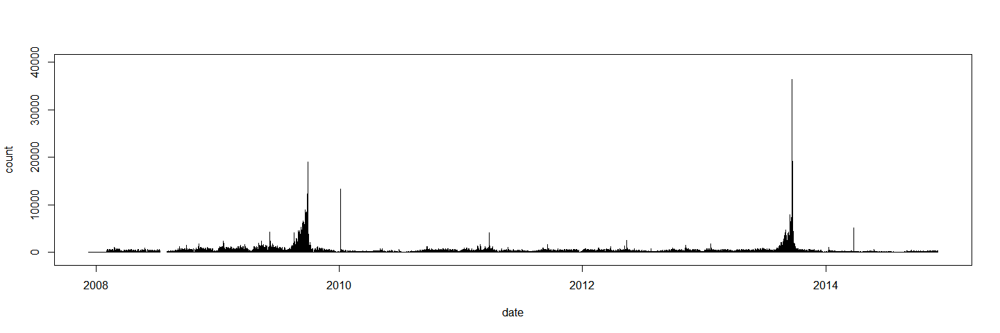
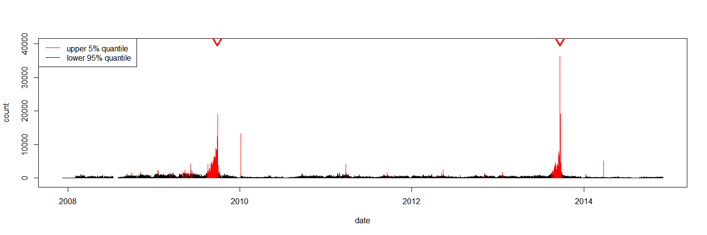

# Studying Public Attention at Election Time
Peter Meißner  
2014-12-03  


## Intro

Elections are major political events and their results determine who gets to be in governemnt for the next view years. But how long do elections and their results capture the public's attention. Let us have a look at Wikipedia page access statistics to find out. 

Our weapon of choice will be *R* and the newly published *wikipediatrend* package that allows for convenient data retreival -- have a look here [wikipediatrend on CRAN](http://cran.r-project.org/web/packages/wikipediatrend/index.html) and especially here [wikipediatrend on GitHub](https://github.com/petermeissner/wikipediatrend) for more information on the package.


As running example we rely on national elections in Germany covered by the 
[German Wikipedia article *Bundestagswahl*](http://de.wikipedia.org/wiki/Bundestagswahl). Since late 2007 (the first time data is available) Germany had two elections at national level -- one in September of 2009 and one in September 2013 -- both resulting in governments led by [Angela Merkel](http://en.wikipedia.org/wiki/Angela_Merkel). 


## Getting data and having a first glance

First, we load the *wikipediatrend* package that will help fetching the data:


```r
require(wikipediatrend)
```

Next, we use `wp_trend()` to download the data and save it into `bt_election`. 
Within `wp_trend()` we use `page = "Bundestagswahl"` to get counts for the  overview article. 
Furthermore, we specify `2007-01-01` in format `yyyy-mm-dd` as `from` date, `de` to get the German language flavor of Wikipedia, `friendly = T` to ensure automatic saving and reuse of downloaded data as well as `userAgent = T` to tell the server that the data is requested by an R user with wikipediatrend package: <code>wikipediatrend running on:  x86_64-w64-mingw32 ,  R version 3.1.2 (2014-10-31)</code>.


```r
bt_election <- wp_trend(  page      = "Bundestagswahl", 
                          from      = "2007-01-01", 
                          lang      = "de", 
                          friendly  = T,
                          userAgent = T)
bt_election <- bt_election[ order(bt_election$date), ]
```

We managed to get 2531 data points:


```r
dim(bt_election)
```

```
## [1] 2531    2
```

... in between 2007-12-10 and 2014-12-04

```r
summary(bt_election$date)
```

```
##         Min.      1st Qu.       Median         Mean      3rd Qu.         Max. 
## "2007-12-10" "2009-09-23" "2011-06-18" "2011-06-16" "2013-03-11" "2014-12-04"
```

... looking like that:

```r
bt_election[55:60, ]
```

```
##          date count
## 55 2008-02-03   349
## 56 2008-02-04   481
## 57 2008-02-05   584
## 58 2008-02-06   668
## 59 2008-02-07   566
## 60 2008-02-08   351
```


```r
plot(bt_election, type="h", ylim=c(-1000,40000))
```

 

The public attention the Wikipedia article got peaks well above 35,000 views per day and overall we can find two distinct bulks of attention each in late 2009 and 2013.


## Tweaking the plot

Let put some more effort into the visualization by splitting our counts into normals (lower 95% of the values) and those being unusual large (upper 5% of the values). 


```r
count_big       <- bt_election$count > quantile(bt_election$count, 0.95)
count_big_col   <- ifelse(count_big, "red", "black")
```

The following plot than visualizes page access counts for the Wikipedia article *Bundestagswahl* from the German Wikipedia on a daily basis with red bars for upper 5% of the  values and black bars for the other 95%. The triangles pointing at the bars from above mark the two election dates -- 27th of September in 2009 and 22nd of September in 2013 -- that occurred during the time span under observation. 


```r
plot(bt_election, type="h", col=count_big_col, ylim=c(-1000,40000))
arrows( x0  = as.numeric(c(wp_date("2013-09-22"),wp_date("2009-09-27"))),
        x1  = as.numeric(c(wp_date("2013-09-22"),wp_date("2009-09-27"))),
        y0  = 40000, y1  = 39500, lwd = 3, col="red")
legend(x="topleft", col=c("red", "black"), legend=c("upper 5% quantile", "lower 95% quantile"), lwd=1)
```

 


Adding the election date to the graph reveals that the article's  public attention imeadatly falls back to normal after the election has taken place. Obviously the highten puplic attention does not stem from people informing themselves after the the election has taken place about its results leaving us with the puzzle, why else they should use the page. Maybe the attention stems from the need to understand what is going on at election day and which of the two votes goes directly to the candidate and which of the two is for the party. 


## Credits

As far as I know we have to thank Domas Mituzas and User:Henrik for the API provided at [stats.grok.se](http://stats.grok.se/) -- [see here](http://stats.grok.se/about). 


